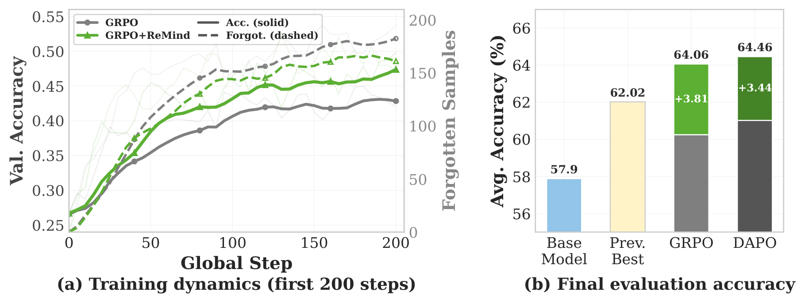
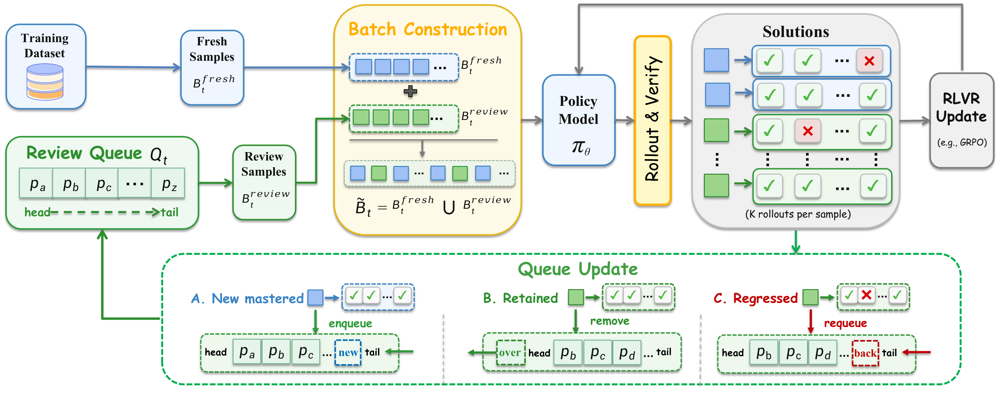

# ReMind: Correct-Set Turnover in RLVR

[](https://arxiv.org/abs/2606.03087)
[](https://huggingface.co/datasets/iieycx/rlsd-train-MMFineReason-123K)
[](LICENSE)

[English](README.md) | [中文](README_zh.md)

**ReMind** studies correct-set turnover in Reinforcement Learning with Verifiable Rewards (RLVR) and introduces a retention-aware review mechanism. The method tracks prompts that a model has already solved and periodically reuses a small subset before rollout, helping reduce regression on previously correct samples without adding extra rollout passes.

This repository provides the ReMind training implementation, a vanilla GRPO baseline configuration, image-text training launchers, and checkpoint conversion tools.

<p align="center">
  
</p>

<p align="center">
  
</p>

## Overview

ReMind is designed for RLVR training scenarios where a model may solve a prompt at one point in training and later fail on the same prompt. Instead of treating each batch as fully independent, ReMind maintains a lightweight review pool of previously mastered prompts and replaces a small portion of future training batches with review samples.

At a high level, the method focuses on:

- measuring correct-set turnover during RLVR training;
- retaining previously solved prompts through pre-rollout review replacement;
- avoiding additional rollout passes for review samples;
- supporting multimodal reasoning experiments on the released dataset.

For algorithm details and experimental results, please refer to the paper:

- [Learning to Solve, Forgetting to Retain: Correct-Set Turnover in RLVR](https://arxiv.org/abs/2606.03087)

## Data

The training and validation data are available on Hugging Face:

- [iieycx/rlsd-train-MMFineReason-123K](https://huggingface.co/datasets/iieycx/rlsd-train-MMFineReason-123K)

You can download the dataset with:

```bash
pip install huggingface_hub

python -c "
from huggingface_hub import snapshot_download
snapshot_download(
    repo_id='iieycx/rlsd-train-MMFineReason-123K',
    repo_type='dataset',
    local_dir='./data'
)
"
```

The dataset release contains:

- `MMFineReason_data_with_conclusion.json`: training samples;
- `MMFineReason_images/`: corresponding training images;
- `vl_math_val_mini_data.json`: validation samples;
- `val_data_image.zip`: validation images.

## Installation

Create a Python environment:

```bash
conda create -n remind python=3.11
conda activate remind
```

Clone the repository and install the training dependencies:

```bash
git clone https://github.com/cyuQ1n/Correct-Set-Turnover-in-RLVR.git
cd Correct-Set-Turnover-in-RLVR
pip install -e .
pip install flash-attn --no-build-isolation
```

Training requires Linux, NVIDIA GPUs, and a compatible CUDA environment. The dependencies use PyTorch 2.8.0, vLLM 0.11.0, and Transformers 4.57.3; the default padding-free configuration requires FlashAttention. Use `Qwen/Qwen3-VL-8B-Instruct` or a local model directory.

## Training

After downloading the data, extract `val_data_image.zip` into the data directory so that relative image paths in the JSON files resolve under `IMAGE_DIR`. Training records use fields including `problem`, `answer`, `images`, and `problem_type`. Each `problem_id` must be unique and non-null; when absent, the loader assigns stable row IDs before filtering.

```bash
export MODEL_PATH=Qwen/Qwen3-VL-8B-Instruct
export TRAIN_DATA=/absolute/path/to/data/MMFineReason_data_with_conclusion.json
export VAL_DATA=/absolute/path/to/data/vl_math_val_mini_data.json
export IMAGE_DIR=/absolute/path/to/data

# Vanilla GRPO baseline
bash examples/remind/run_grpo.sh

# GRPO + ReMind
bash examples/remind/run_grpo_remind.sh
```

Each command starts a separate training run with its own experiment directory. Add `--dry-run` to inspect the command without loading a model or starting training. Append OmegaConf overrides such as `trainer.max_steps=10 trainer.val_before_train=false` to customize a run. Logging defaults to the console and local files. For W&B, run `wandb login` and append `'trainer.logger=[console,file,wandb]'`.

| Setting | Default |
|---|---|
| Prompts per step / rollouts per prompt | 256 / 8 |
| Training epochs / learning rate | 1 / 1e-6 |
| Maximum prompt / response length | 4096 / 4096 |
| Replacement ratio per review / review interval | 0.10 / 5 steps |
| Enqueue probability / queue capacity | 0.25 / 20,000 |
| First review step | 50 |

The default uses one node with eight GPUs and rollout tensor parallelism of four. Adjust `NPROC_PER_NODE` and `worker.rollout.tensor_parallel_size=...` for your hardware, keeping batch divisibility requirements in mind. For multiple nodes, first start a Ray cluster with the same environment and files on every node, then set `RAY_ADDRESS` and `NNODES` and run the launcher once on the head node.

ReMind probabilistically enqueues all-correct prompts from the training stream. On review steps, queued prompts replace the tail of the batch and generate fresh rollouts under the current policy. All-correct reviewed prompts graduate; regressed prompts return to the queue. Review occupies approximately 2% of training prompts by default without increasing the per-step rollout count. The separate diagnostic cohort is disabled by default; `algorithm.monitor_cohort_enabled=true` adds evaluation rollouts for analysis.

## Utilities

The top-level `scripts/` directory contains checkpoint utility code. For example, FSDP sharded checkpoints can be merged into a Hugging Face model directory with:

```bash
CKPT_DIR=/path/to/checkpoints/experiment/global_step_xxx/actor \
DST_MODEL_DIR=/path/to/output/merged_model \
bash scripts/model_merger.sh
```

## Repository Layout

```text
├── assets/              # Figures used in the paper and README
├── examples/remind/     # GRPO / ReMind launchers, configs, prompts, and rewards
├── verl/                # Training framework and review queue implementation
├── tests/               # CPU unit tests and launcher checks
├── scripts/             # Checkpoint conversion utilities
├── requirements.txt     # Dependency reference
├── pyproject.toml       # Formatting and build configuration
├── setup.py             # Editable-install entry point
└── LICENSE              # Apache-2.0 license
```

The core implementation is in `verl/trainer/ray_trainer.py` and `verl/trainer/config.py`. Run `make test` for CPU tests of review-queue behavior, configuration, and launch commands. Full model training requires the GPU environment described above.

## Citation

```bibtex
@misc{qin2026learningsolveforgettingretain,
      title={Learning to Solve, Forgetting to Retain: Correct-Set Turnover in RLVR},
      author={Chuanyu Qin and Chenxu Yang and Qingyi Si and Naibin Gu and Peng Fu and Zheng Lin},
      year={2026},
      eprint={2606.03087},
      archivePrefix={arXiv},
      primaryClass={cs.LG},
      url={https://arxiv.org/abs/2606.03087},
}
```

## Acknowledgements

This project builds on the following open-source projects:

- [EasyVideoR1](https://github.com/cyuQ1n/EasyVideoR1): Easier RL for video understanding
- [EasyR1](https://github.com/hiyouga/EasyR1): An efficient and scalable multimodal RL training framework
- [veRL](https://github.com/volcengine/verl): High-performance RL and HybridEngine

## License

This repository is released under the [Apache License 2.0](LICENSE).
